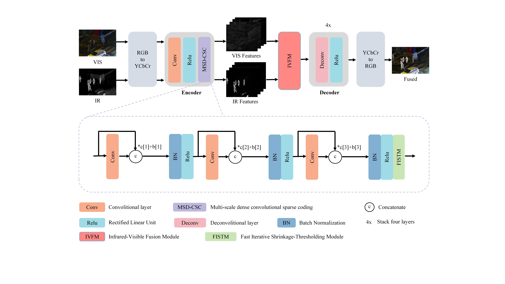
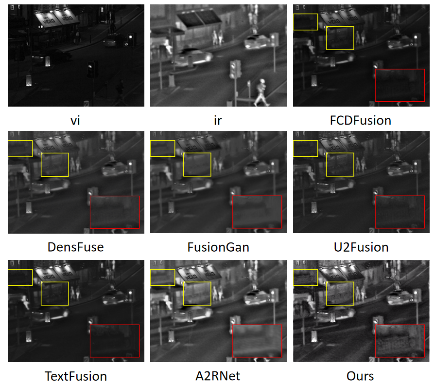

# MDCFusion: Enhancing Infrared and Visible Image Fusion through Multi-Scale Dense Convolutional Sparse Coding
### Note:This manuscript has been submitted to The Visual Computer and is currently under external review. We sincerely appreciate your interest and support. The README will be further improved after acceptance.
## 1. Progect Overview
Infrared and visible image fusion (IVIF) aims to integrate complementary information from both modalities, enhancing the overall quality and informativeness of the fused image. Traditional IVIF methods based on convolutional sparse coding (CSC) often suffer from weak feature extraction and poor detail preservation. To address these issues, we present a Multi-Scale Dense Convolutional Sparse Coding Fusion Network (MDCFusion), which embeds a learnable MSD-CSC module within an encoder-decoder framework. This approach combines the theoretical interpretability of CSC with the powerful feature learning capabilities of deep networks. By leveraging dense connectivity within the MSD-CSC module, MDCFusion facilitates hierarchical feature reuse, enhancing texture detail and edge structure preservation. Additionally, we propose an additive fusion rule and a threshold filtering strategy to effectively integrate complementary information during fusion, the latter of which can effectively suppress redundant infrared information. Experiments on four publicly available datasets demonstrate that MDCFusion outperforms state-of-the-art methods in both visual quality and objective metrics, achieving significant improvements in texture preservation and structural clarity.
## 2. Framework

## 3. Environment Setup
### Sofware Dependencies
Linux 6.8.0

Python 3.7.12

pytorch 1.12.1

cuda 11.3
### Hardware Requirements
NVIDIA GeForce RTX3090 with 24.00 GB
## 4. Installation and Usage
### Clone the repository
```bash
git clone https://github.com/junhaohe777/MDCFusion.git
cd tests
```

#### Usage:
* Place the test image in the input folder.
* Run the test.py to test.
* The fused results will be saved in the output folder.

## 5. Key Algorithms and Implementation
First, the RGB images are converted to the YCbCr color space, where the fusion process is mainly performed on the luminance (Y) channel. The encoder is applied to decompose the Y channel features of the infrared and visible images, after which a fusion algorithm is used to integrate these features. The fused Y channel features are then decoded and combined with the Cb and Cr components from the initial decomposition. Finally, the fused result is transformed back into the RGB space to generate the final image.

## 6. Datasets and Experiments 

#### Datasets 
* The TNO dataset can be downloaded at the following address: [https://figshare.com/articles/dataset/TNO_Image_Fusion_Dataset/1008029](https://figshare.com/articles/dataset/TNO_Image_Fusion_Dataset/1008029)
* The Roadscene dataset can be downloaded at the following address: [https://github.com/jiayi-ma/RoadScene](https://github.com/jiayi-ma/RoadScene)
* The LLVIP dataset can be downloaded at the following address: https://bupt-ai-cz.github.io/LLVIP/
* The M3FD dataset can be downloaded at the following address:https://universe.roboflow.com/rgbi/m3fd-tlj7u

### Experiments 



## 6. Citation
#### If you use this project's code,please cite our paper:
```bibtex
@article{xxx_2025_ME-PMA,
  title={MDCFusion: Enhancing Infrared and Visible Image Fusion through Multi-Scale Dense Convolutional Sparse Coding},
  author={xxx},
  journal={The Visual Computer},
  volume={xx},
  number={x},
  pages={x--x},
  year={2025}
}
```
## 7. Contact Information
- **Email**: 2817881079@qq.com or chengfangzhang@scpolicec.edu.cn
