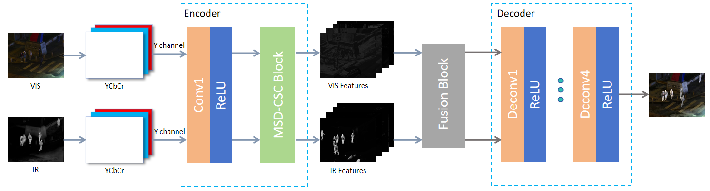

# MDCFusion: Multi-Scale Dense Convolutional Sparse Coding Fusion Network for Infrared and Visible Image
### We sincerely appreciate your interest and support. The README will be further improved after acceptance.
## 1. Progect Overview
Traditional convolutional sparse coding (CSC) -based fusion methods suffer from limited feature extraction and insufficient detail preservation, particularly in complex scenes with rich textures. To address these limitations, this paper proposes a novel method based on multi-scale dense convolutional sparse coding. Specifically, a multi-scale dense convolutional sparse coding module is integrated into an encoder-decoder framework to enhance feature representation while ensuring interpretability. The dense connectivity mechanism improves cross-layer feature reuse, effectively preserving both global structures and local textures during fusion. Additionally, two fusion strategies are designed to balance complementary modality features: an additive fusion rule and a novel threshold filtering strategy to suppress redundant infrared information. The fused features are subsequently decoded to reconstruct the fused image with enhanced contrast and clarity. Experiments results demonstrate that the proposed method achieves superior fusion performance compared to state-of-the-art methods in terms of both visual quality and objective metrics.
## 2. Framework

## 3. Environment Setup
### Sofware Dependencies
Python 3.7.12
pytorch 1.12.1
cuda 11.3
### Hardware Requirements
NVIDIA GeForce RTX3090
## 4.Usage：
* Place the test image in the tests/input folder.
* Run the test.py to test.
* The fused results will be saved in the tests/output folder.
  
## 5. Datasets and Experiments 

#### Datasets 
* The TNO dataset can be downloaded at the following address: [https://figshare.com/articles/dataset/TNO_Image_Fusion_Dataset/1008029](https://figshare.com/articles/dataset/TNO_Image_Fusion_Dataset/1008029)
* The Roadscene dataset can be downloaded at the following address: [https://github.com/jiayi-ma/RoadScene](https://github.com/jiayi-ma/RoadScene)
* The LLVIP dataset can be downloaded at the following address: https://bupt-ai-cz.github.io/LLVIP/
* The M3FD dataset can be downloaded at the following address:https://universe.roboflow.com/rgbi/m3fd-tlj7u

### Experiments 


## 6. Citation
#### If you use this project's code,please cite our paper:
```bibtex
@article{xxx_2025_ME-PMA,
  title={MDCFusion: Multi-Scale Dense Convolutional Sparse Coding Fusion Network for Infrared and Visible Image},
  author={xxx},
  journal={xxx},
  volume={xx},
  number={x},
  pages={x--x},
  year={2025}
}
```
## 7. Contact Information
- **Email**: 2817881079@qq.com or chengfangzhang@scpolicec.edu.cn
