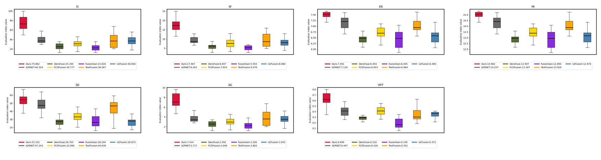

# MDCFusion: Multi-Scale Dense Convolutional Sparse Coding Fusion Network for Infrared and Visible Image
### We sincerely appreciate your interest and support. The README will be further improved after acceptance.
## 1. Progect Overview

## 2. Framework

## 3. Environment Setup
### Sofware Dependencies

### Hardware Requirements

#### Usage：
* Place the test image in the tests/input folder.
* Run the test.py to test.
* The fused results will be saved in the tests/output folder.

## 5. Key Algorithms and Implementation


## 6. Datasets and Experiments 

#### Datasets 
* The TNO dataset can be downloaded at the following address: [https://figshare.com/articles/dataset/TNO_Image_Fusion_Dataset/1008029](https://figshare.com/articles/dataset/TNO_Image_Fusion_Dataset/1008029)
* The Roadscene dataset can be downloaded at the following address: [https://github.com/jiayi-ma/RoadScene](https://github.com/jiayi-ma/RoadScene)
* The LLVIP dataset can be downloaded at the following address: https://bupt-ai-cz.github.io/LLVIP/
* The M3FD dataset can be downloaded at the following address:https://universe.roboflow.com/rgbi/m3fd-tlj7u

### Experiments 



## 7. Citation
#### If you use this project's code,please cite our paper:
```bibtex
@article{xxx_2025_ME-PMA,
  title={Enhanced Infrared and Visible Image Fusion via Latent Low-Rank and Coupled Feature Learning},
  author={xxx},
  journal={xxx},
  volume={xx},
  number={x},
  pages={x--x},
  year={2025}
}
```
## 8. Contact Information
- **Email**: 2817881079@qq.com or chengfangzhang@scpolicec.edu.cn
